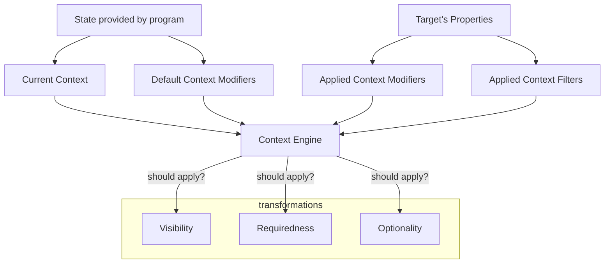

# Requiredness and Optionality in TypeSpec

This proposal suggests four new expressions:

1. A new symbol, `!`, to mark properties as _explicitly required_.
2. A new decorator, `@required`, to mark properties as required in specific contexts.
3. A new decorator, `@optional`, to mark properties as optional in specific contexts.
4. A new decorator, `@defaultRequiredness`, to remove contextual requiredness behavior in specific contexts.

<br>

## Goals

1. Give developers a way to write shared TypeSpec that is usable across "default optional" and "default required" protocols.
2. Provide more control over requiredness/optionality based on context.
    1. Find a general solution to [the `@patch` problem](#patch).
3. Promote comprehension and maintainability by aligning with existing systems.

<br>

# Background

Let's start by examining the current state of things in TypeSpec.

## Requiredness

Model properties in TypeSpec can either be [optional][optional-properties] or not.

This determination is made by the presence or absence of the `?` symbol after the property name.

```typespec
model User {
  name: string; // not optional
  email?: string; // optional
}
```

For the most part, TypeSpec emitters assume "not optional" to mean "required".
The above TypeSpec, for instance, will be represented as the following:

### OpenAPI emitter

Adds all not optional properties to the [`required` array defined by JSON schema][json-schema-required].

```yaml
required:
  - name
```

<details>
<summary>OpenAPI emitter output</summary>

```yaml
User:
  type: object
  required:
    - name
  properties:
    name:
      type: string
    email:
      type: string
```

</details>

### JSON Schema emitter

Adds all not optional properties to the [`required` array defined by JSON schema][json-schema-required].

```yaml
required:
  - name
```

<details>
<summary>JSON Schema emitter output</summary>

```yaml
$schema: https://json-schema.org/draft/2020-12/schema
$id: User.yaml
type: object
properties:
  name:
    type: string
  email:
    type: string
required:
  - name
```

</details>

### Protobuf emitter

Proto3 [does not have required fields][protobuf-required]. All fields are optional.

```protobuf
string name = 1;
string email = 2;
```

<details>
<summary>Protobuf emitter output</summary>

```protobuf
syntax = "proto3";

message User {
  string name = 1;
  string email = 2;
}
```

</details>

### `http-server-javascript` emitter

One more example, to show how this is handled in TypeScript output.

```typescript
name: string;
email?: string;
```

<details>
<summary>JavaScript HTTP server emitter output</summary>

```typescript
export interface User {
  name: string;
  email?: string;
}
```

</details>

## Visibility

TypeSpec has a robust [visibility system][visibility-system] that allows developers to specify which properties are visible in which contexts.

The visibility system handles **presence** and **absence** of properties. In the terminology of the visibility system, these are referred to as **visible** and **invisible**.

Model properties can have default visibility as defined by the [`@defaultVisibility`][defaultVisibility] and [`@withDefaultKeyVisibility`][withDefaultKeyVisibility] decorators.

Visibility is entirely contextual. The notion of a property being visibile or invisible at a "model level"  is simply whether the property exists on the model.

The visibility context is specified using [visibility modifiers][visibility-modifiers].
A model property is assigned a set of visibility modifiers through a combination of decorators.

<br>

# Problem

There are two main problems we are looking to solve:

1. While TypeSpec supports specifying explicit optionality, it does not support specifying explicit requiredness.
2. Optionality and requiredness can only be specified at the model level, and cannot change based on the context in which the model is used.

### Explicit Optionality/Requiredness

When the `?` modifier is absent, we will say the property has "default optionality".  As we saw above, the optionality/requiredness of a property with default optionality is determined by the emitter.

Protobuf, for example, treats these fields as equivalent to optional fields. OpenAPI and JSON schema treat them as required.

GraphQL, which uses nullable/non-nullable to represent optional/required, treats all fields as nullable unless they are explicitly marked as non-nullable.
A GraphQL emitter will treat all properties with default optionality as nullable.

Let's call OpenAPI and JSON schema **"default required" emitters**, and GraphQL a **"default optional" emitter**.

**While we have a way to tell "default required" emitters that a property is _optional_, we do not have a way to tell "default optional" emitters that a property is _required_.**

### Contextual Optionality/Requiredness

The second problem is that optionality and requiredness are defined at the model level, but they may need to change based on the context in which the model is used.

<a name="patch"></a>
The primary existing example of this is the way that `@typespec/http` handles `PATCH` operations.

When the `@patch` decorator is applied to an operation, a [new "view" of that model](https://typespec.io/docs/language-basics/visibility/#_top) is created with two primary behaviors:

1. Only properties with the `update` visibility are included in the model. This is consistent with the rules of [automatic visibility](https://typespec.io/docs/libraries/http/operations/#automatic-visibility), and is roughly equivalent to applying the `@withLifecycleUpdate` decorator (or `@withVisibility(Lifecycle.update)`) to a model to create the update "view".
2. All properties are made optional. This behavior is [implicit based on the visibility of the properties](https://github.com/microsoft/typespec/pull/1345), and is not configurable.

The first behavior is not uncommon; indeed, the `Http` library defines [default visibility modifiers for all HTTP verbs][http-default-verb-visibility].
Since these are merely default modifiers, the TypeSpec developer can override them by applying the `@parameterVisibility` and/or `@returnTypeVisibility` decorator to the operation.

The latter is unique to `PATCH`. It has been [discussed previously](https://github.com/microsoft/typespec/issues/2150#issuecomment-1622215786) that perhaps this behavior should also be overridable with a decorator:

> Add some decorator to explicitly say that the input properties are made optional or not. This can be combined with (1) or (2) or status quo as an override.
 
As recently as Feb 4, 2025, we're still looking for a way to [make this behavior more explicit](https://github.com/microsoft/typespec/discussions/5759#discussioncomment-12057390).

**There is no current way for a TypeSpec developer to specify optionality/requiredness based on context.**

<br>

# Implementation

<a name="terminology"></a>
## Terminology

To speak more clearly about the concepts of visibility and requiredness, we will refer to the following in the rest of the document.

1. <a name="context-modifier"></a>"visibility modifier" is called "context modifier"
2. "visibility class" is called "context class"
3. "visibility filter" is called "context filter"
4. (possibly) "visibility" will be renamed "contextual visibility", mirroring "contextual requiredness".

## `!` symbol

The `!` symbol is used to mark a property as _explicitly required_.

It is specified in the same manner as the `?` symbol to [mark a property as optional][optional-properties].

```typespec
model Dog {
  address!: string;
}
```

It is _not_ possible to mark a property as both explicitly required and explicitly optional.

## `@required`, `@optional`, `@defaultRequiredness` decorators

These decorators are used to control a property's optionality/requiredness in specific contexts.

The behavior of these decorators mirror that of the `@visibility`/`@removeVisibility` decorators.

The difference is that while a context modifier has two possible states within the visibility system (present or absent), it has three possible states in the requiredness system:
- absent
- required
- optional

Visibility provides a means to specify the present state with `@visibility` and the absent state with `@removeVisibility`.

Requiredness provides a means to specify the required state with `@required`, the optional state with `@optional`, and the absent state with `@defaultRequiredness`.

### `@required` decorator

```typespec
@required(...contextModifiers: EnumMember[])
```

<details><summary>Specific behavior</summary>

The `@required` decorator is used to mark a property as required with given [context modifiers](#context-modifier).
It takes a list of context modifiers as arguments and sets them as _contextual requiredness_ on the property.
For example:

```typespec
@required(Lifecycle.Create, Lifecycle.Read)
name: string;
```

The behavior of the `@required` decorator mirrors that of the `@visibility` decorator. Specifically:

If contextual requiredness has already been set explicitly on a property, the `@required` decorator sets requiredness only on its own context modifiers (it does not affect currently-active modifiers)
For example:

```typespec
@required(Lifecycle.Create)
@required(Lifecycle.Read)
name: string;
```

In this example, the `name` property has both the `Create` and `Read` context modifiers set to required, but not the `Update` context modifier.
The `@required` decorator starts from an empty set of modifiers and adds the `Create` modifier, then adds the `Read` modifier.

</details>

### `@optional` decorator

```typespec
@optional(...contextModifiers: EnumMember[])
```

<details><summary>Specific behavior</summary>

The `@optional` decorator is used to mark a property as optional with given [context modifiers](#context-modifier).
It takes a list of context modifiers as arguments and sets them as _contextual optionality_ on the property.
For example:

```typespec
@optional(Lifecycle.Create, Lifecycle.Read)
name: string;
```

The behavior of the `@optional` decorator also mirrors that of the `@visibility` decorator. Specifically:

If contextual requiredness has already been set explicitly on a property, the `@optional` decorator sets optionality only its own context modifiers (it does not affect currently-active modifiers).
For example:

```typespec
@optional(Lifecycle.Create)
@optional(Lifecycle.Read)
name: string;
```

In this example, the `name` property has both the `Create` and `Read` context modifiers set to optional, but not the `Update` context modifier.
The `@optional` decorator starts from an empty set of modifiers and adds the `Create` modifier, then adds the `Read` modifier.

</details>

### `@defaultRequiredness` decorator

```typespec
@defaultRequiredness(...contextModifiers: EnumMember[])
```

The visibility system provides a [`@removeVisibility` decorator][removeVisibility] that basically serves as a way to "undo" a `@visibility` decorator.
Similarly, `@defaultRequiredness` can "undo" `@required` or `@optional` without explicitly setting requiredness to the inverse.

We'd probably want to avoid `@removeRequiredness` or `@removeOptionality` since these suggest that the properties are being explicitly set to optional or required, respectively.

Another option would be a decorator that handles both visibility and requiredness, e.g. `@removeContextModifiers`:

```typespec
enum ContextSystem {
  Visibility,
  Requiredness,
}

@removeContextModifiers(system: valueof ContextSystem, ...contextModifiers: valueof EnumMember[])
```

## Effect on emitters

The effect of these specifiers will be different between "default required" and "default optional" emitters, as this table demonstrates:

|                                                                                                                                                           | Protocol-agnostic | Required by default (e.g. OAI)                                         | Optional by default (e.g. GraphQL)                                     |
|-----------------------------------------------------------------------------------------------------------------------------------------------------------|-------------------|------------------------------------------------------------------------|------------------------------------------------------------------------|
| `@visibility(Lifecycle.Update, Lifecycle.Create, Vis.Foo)`<br/>`@required(Lifecycle.Create)`<br/>`@optional(Lifecycle.Update)`<br/>`password: password;`  | **Undefined**     | Required on `Create`.<br/>Optional on `Update`.<br/>Required on `Foo`. | Required on `Create`.<br/>Optional on `Update`.<br/>Optional on `Foo`. |
| `@visibility(Lifecycle.Update, Lifecycle.Create, Vis.Foo)`<br/>`@required(Lifecycle.Create)`<br/>`@optional(Lifecycle.Update)`<br/>`password?: password;` | **Optional**      | Required on `Create`.<br/>Optional on `Update`.<br/>Optional on `Foo`. | Required on `Create`.<br/>Optional on `Update`.<br/>Optional on `Foo`. |
| `@visibility(Lifecycle.Update, Lifecycle.Create, Vis.Foo)`<br/>`@required(Lifecycle.Create)`<br/>`@optional(Lifecycle.Update)`<br/>`password!: password;` | **Required**      | Required on `Create`.<br/>Optional on `Update`.<br/>Required on `Foo`. | Required on `Create`.<br/>Optional on `Update`.<br/>Required on `Foo`. |


<br>

## Implications

### Decorator conflict

If a property is marked with multiple requiredness decorators in the same context, the most-recently-specified decorator "wins".

This matches the existing behavior of the `@visibility` and `@removeVisibility` decorators.

```typespec
model User {
  @optional(Lifecycle.Create)
  @required(Lifecycle.Create)
  @removeVisibility(Lifecycle.Create)
  name: string; // This will be optional on Create
  
  @required(Lifecycle.Create)
  @optional(Lifecycle.Create)
  @removeVisibility(Lifecycle.Create)
  email?: string; // This will be required on Create
  
  @removeVisibility(Lifecycle.Create)
  @required(Lifecycle.Create)
  @optional(Lifecycle.Create)
  address?: string; // This will have default requiredness on create (in this case, optional)
}
```

<br>

<a name="visibility-requiredness-conflict"></a>
### Visibility and requiredness conflict
This proposal introduces a bit more of an explicit relationship between requiredness and visibility. For a given lifecycle, there are now six possibilities:
- visible and default requiredness
- visible and required
- visible and optional
- invisible and default requiredness
- invisible and required
- invisible and optional

The latter two introduce a bit of a conflict — if a property is invisible, it cannot be "required" as such.
This could be explicitly raised as a validation error, e.g.
```typespec
  @invisible(Lifecycle.Create)
  @required(Lifecycle.Create) id: int64; // Error: id cannot be required in "create" if it is not visible
```

or it could be silently ignored, e.g.
```typespec
  @invisible(Lifecycle.Create)
  @required(Lifecycle.Create) id: int64;
  // is equivalent to (in the context of Create)
  @invisible(Lifecycle.Create) id?: int64;
  // is equivalent to (in the context of Create)
  @invisible(Lifecycle.Create) id: int64;
```

<br>

### Automatic requiredness

We can now take the concept of [automatic visibility][automatic-visibility] and use a parallel concept of automatic requiredness to describe the concept of "default required" and "default optional" emitters.

For instance, we can describe the `Http` library as applying the follow automatic requiredness to fields not annotated with `?` or `!`:

| Name               | Required in             | Optional in     |
|--------------------|-------------------------|-----------------|
| `Lifecycle.Read`   | Any response            |                 |
| `Lifecycle.Query`  | `GET` or `HEAD` request |                 |
| `Lifecycle.Create` | `POST` or `PUT` request |                 |
| `Lifecycle.Update` | `PUT` request           | `PATCH` request |
| `Lifecycle.Delete` | `DELETE` request        |                 |


<br>

### Replacing legacy `@parameterVisibility` behavior

From [the docs on `@parameterVisibility`][parameterVisibility]:

> WARNING: If no arguments are provided to this decorator, … the HTTP library will disable the feature of `@patch` operations that causes the properties of the request body to become effectively optional.
> Some specifications have used this configuration in the past to describe exact PATCH bodies, but using this decorator with no arguments in that manner is not recommended.
> The legacy behavior of `@parameterVisibility` with no arguments is preserved for backwards compatibility pending a future review and possible deprecation.

This behavior can be replaced with the new `@required` decorator, which is more explicit and less likely to be used incorrectly.

If we have defined:
```typespec
model User {
  name: string;
  email?: string;
}
```

The existing behavior is that
```typespec
@patch op update(User): User;
```

produces (name and email fields optional)

while
```typespec
@parameterVisibility
@patch op update(User): User;
```
produces (name required, email optional)


The new hotness would be achieved by instead annotating the `User.name` property
```typespec
@required(Lifecycle.Update) name: string;
// or
name!: string;
```
to produce the same result (name required, email optional)

<br>

### Reconciling visibility and requiredness

All of this taken together, we can start to see a parallel structure emerge between visibility and requiredness.

Visibility can be specified absent of context, or given a context modifier. So can requiredness.

| State     | Contextless expression                         | Contextual expression                         |
|-----------|------------------------------------------------|-----------------------------------------------|
| Visible   | implied by the existence of the model property | `@visibility(<list of visibility modifiers>)` |
| Invisible | implied by the absence of the model property   | `@invisible(<list of visibility modifiers>)`  |
| Required  | with `!` modifier                              | `@required(<list of context modifiers>)`      |
| Optional  | with `?` modifier                              | `@optional(<list of context modifiers>)`      |

<br>

We can also see how the sets of decorators follow somewhat of a parallel pattern. Visibility and requiredness define their own, roughly equivalent decorators to apply their concept to model properties. But they can leverage the same decorators when applied to models and operations (where for requiredness, we have simply changed the name of the existing decorator).

|       as applied to…        |                                 Visibility                                 |                                         Requiredness                                          |
|:---------------------------:|:--------------------------------------------------------------------------:|:---------------------------------------------------------------------------------------------:|
|      a model property       |            `@visibility`<br>`@invisible`<br>`@removeVisibility`            |                     `@required`<br>`@optional`<br>`@defaultRequiredness`                      |
| all of a model’s properties |                        `@withDefaultKeyVisibility`                         |                                 N/A (or `@defaultOptional`)?                                  |
|      transform a model      | `@withVisibility`<br>`@withVisibilityFilter`<br>`@withLifecycleUpdate`<br>`@withUpdateableProperties` | `@withContext`<br>`@withContextFilter`<br>`@withLifecycleUpdate`<br>`@withOptionalProperties` |
|          operation          |             `@parameterVisibility`<br>`@returnTypeVisibility`              |                          `@parameterContext`<br>`@returnTypeContext`                          |

<br>

## Terminology updates

Finally, to make these systems more comprehensible to developers, we suggest making the [aforementioned terminology changes](#terminology) throughout TypeSpec code and documentation:

1. <a name="context-modifier"></a>"visibility modifier" will be renamed "context modifier"
2. "visibility class" will be renamed "context class"
3. (possibly) "visibility" will be renamed "contextual visibility", mirroring "contextual requiredness".


<br>

# Considerations

## How is this different from visibility?

Requiredness is a different concept from visibility. Visibility is about which properties _can_ appear in a view, while requiredness is about what properties _will_ appear in a view. A property with `Lifecycle.read` visibility is included in the read view, but it is not necessarily required to be present in all instances of that view.

The precedent has been set with the `@patch` decorator that visibility context can affect optionality.

<br>

## Does requiredness make sense on a model level?

Models in TypeSpec can mean different things.
While in OpenAPI they are typically only used to define the shape of a request or response body (indeed, there is [an option][omit-unreachable-types] not to emit any models unless they are part of an operation), in other protocols like JSON schema there is no notion of operations, and so models must be context-free.

<br>

## Is this protocol-specific?

We've already encountered the concepts of "default required" emitters and "default optional" emitters, suggesting that the emitter (and by extension, the protocol) has some role to play in determining the requiredness of a property.

To that end, perhaps it should be the emitter that provides mechanisms to explicitly specify the requiredness of a property, in a way that only affects that emitter.

However, this discourages the creation of protocol-agnostic API definitions, which is a [key feature of TypeSpec](https://typespec.io/data-validation/).
If the model definition is used to create a GraphQL API, a RESTful API (described by OpenAPI), and a set of JSON schemas, it should be possible to specify the requiredness of a property, both contextual and context-free, in a way that yields a consistent representation in all protocols.
Generated code for each protocol can then be consistent with the model definition.

If instead a protocol-specific decorator is used, there will be a discrepancy in behavior among different systems handling the same data.

<br>

## What about the `@invisible` decorator?

The [`@invisible` decorator][invisible] is similar; however instead of setting the default visibility modifiers for the property, it explicitly clears out all visibility modifiers.

In the context of requiredness, removing all context modifiers means that requiredness is determined explicitly on the model property by `?` or `!`, or neither.

As above, this could be a new decorator (e.g. `@clearRequiredness` or `@explicitRequiredness`), or it could be combined with the `@invisible` decorator:

```typespec
@clearContext(system: valueof ContextSystem, contextClass: Enum)
```

<br>

## What about other visibility-related decorators?

There are additional decorators related to the visibility system:

### [`@withDefaultKeyVisibility`][withDefaultKeyVisibility]

This seems like syntactic sugar for common patterns. We can extend this to requiredness if and when the need arises.

### Model visibility modifiers

- [`@parameterVisibility`][parameterVisibility]
- [`@returnTypeVisibility`][returnTypeVisibility]
- [`@withVisibility`][withVisibility]
- [`@withVisibilityFilter`][withVisibilityFilter]

These are useful for our purposes. Specifying the visibility filter for a model (which all of these effectively do) is really specifying the context modifiers for the model.
The context modifiers will also set the requiredness of the properties within, depending on the context modifiers applied with `@required` and `@optional`. So we do not need to create new equivalent decorators.

We might want to rename these to swap "context" in where "visibility" appears, but it seems unlikely to cause confusion as-is.

- [`@withLifecycleUpdate`][withLifecycleUpdate]

The thing that appears to make this distinct from `@withVisibility(Lifecycle.update)` is that when recursing through nested properties, properties that are visible on update _or_ create are kept.
It's not clear that this special case is as important for requiredness.

- [`@withUpdateableProperties`][withUpdateableProperties]

Unclear how this is different from `@withVisibility(Lifecycle.update)`.

### [`@defaultVisibility`][defaultVisibility]

This may or may not be something that we want to extend to requiredness.

While the concept applies equally, it may not be the case that the default context modifiers for a context class should be the same when applied to requiredness as when applied to visibility.

To go back to the [HTTP PATCH](#patch) example, properties on a model should probably be visible in `PATCH` operations by default.
However, we also want them to be optional by default.

The `Lifecycle` context class is essentially defined like this today:

```typespec
@defaultVisibility(Lifecycle.Read, Lifecycle.Create, Lifecycle.Update, Lifecycle.Delete, Lifecycle.Query)
enum Lifecycle {
   Read,
   Create,
   Update,
   Delete,
   Query,
}
```

We would not want properties in all of those lifecycle states to be required by default, nor optional by default.

So we would not want to do something like

```typespec
@defaultContextModifier(Lifecycle.Read, Lifecycle.Create, Lifecycle.Update, Lifecycle.Delete, Lifecycle.Query)
enum Lifecycle {
   Read,
   Create,
   Update,
   Delete,
   Query,
}
```

as what context modifiers should be default depends on what transformation should be applied in that context.

It may make sense instead to do this with separate decorator:

```typespec
@defaultVisibility(Lifecycle.Read, Lifecycle.Create, Lifecycle.Update, Lifecycle.Delete, Lifecycle.Query)
@defaultRequired(Lifecycle.Read)
@defaultOptional(Lifecycle.Update)
enum Lifecycle {
   Read,
   Create,
   Update,
   Delete,
   Query,
}
```


Useful as-is. This one might be more important to rename to `@defaultContextModifier` or similar, since it is not just about visibility. 

<br>

## What are the implications for current TypeSpec emitters?

Existing "default required" emitters will see no change from the `!` symbol.
They already treat all properties without the `?` symbol as required, and a property cannot be given the `!` symbol without removing the `?` symbol.


<br>

# TypeSpec Context Engine

What we arrive at, should we implement this proposal, is a generic "context" system defined in TypeSpec.
Its key components are:

- **Context modifiers**, which are used to specify contexts in which to apply a transformation
- **Context classes**, which are used to group related context modifiers
- **Contextal transformations**, which apply a specific behavior to a target when the current context matches the context modifiers of the transformation

Visibility, optionality, and requiredness can all be seen now as "contextual transformations".

As an implementation, TypeSpec would provide a generic "context engine" that can understand the current context, the applied context modifiers, and applied context filters (currently "visibility filters"), and produce a boolean result for each transformation that indicates whether it should apply.



Such a model can be extended to fit future use cases for contextual transformations, though we will not speculate on what those might be.

<br>

# Real-world use cases

## Pinterest `customer_list` API

The [Pinterest `customer_list` API][pinterest-customer-list] has two properties that make it difficult to express with current TypeSpec:
1. It has a `PATCH` operation with required fields.
2. The `name` property is required when creating the model, but optional when reading it.

As mentioned above, the `@patch` decorator in the `@typespec/http` library currently makes all properties optional.

[RFC 5789][rfc-5789] does not specify what the patch document must look like. Indeed, the RFC states

> there is no single default patch document format that implementations are required to support.

It is common to use [JSON Patch][rfc-6902], especially with APIs that are RESTful, described by OpenAPI, and/or use the `application/json` content-type.
Thus the `@patch` decorator's behavior is a reasonable default.

However, TypeSpec should be able to describe APIs as they are, not just how they ought to be.

Currently, it would have to be defined in TypeSpec using the legacy behavior of the [`@parameterVisibility` decorator][parameterVisibility], which is not recommended.

It is also currently not possible to use visibility on `CustomerList` because of the `name` property: a property that is required when creating the model but optional on response.
There is no way to describe this with a single model property, and no "special" behavior or decorator behavior that can describe this use case.
While an argument could be made that this is a strange thing to have in an API, it is what it is and we want to be able to describe that in TypeSpec.

<details open><summary>Current TypeSpec</summary>

```typespec
enum UserListType {
  EMAIL,
  IDFA,
  MAID,
  LR_ID,
  DLX_ID,
  HASHED_PINNER_ID,
}

enum UserListOperationType {
  ADD,
  REMOVE,
}

// All of the properties in the response model are optional
model CustomerList {
  name?: string;
  records?: string;
  ...
}

model CustomerListCreate {
  name: string;
  records: string;
  list_type?: UserListType = UserListType.EMAIL;
}

model CustomerListUpdate {
  records: string;
  operation_type: UserListOperationType;
}

@route("/customer_lists")
interface customer_lists {
  @post op create(@body customer_list: CustomerList): CustomerList;
  
  @route("/{customer_list_id}")
  @get op get(@path customer_list_id: string): CustomerList;
  
  @route("/{customer_list_id}")
  @parameterVisibility // using the no arguments "hack"
  @patch op update(@path customer_list_id: string, @body customer_list: CustomerList): CustomerList;
}
```

</details>

Given this proposal, we could instead define it as

<details open><summary>Proposed TypeSpec</summary>

```typespec
model CustomerList {
  @visibility(Lifecycle.Read) id?: string; // only in the response, and optional
  
  @visibility(Lifecycle.Read, Lifecycle.Create)
  @required(Lifecycle.Create) name?: string; //optional in response, required on create
  
  @visibility(Lifecycle.Create, Lifecycle.Update) records!: string; // required in create and update
  
  @visibility(Lifecycle.Create) list_type?: UserListType = UserListType.EMAIL; //optional on create

  @visibility(Lifecycle.Update) operation_type!: UserListOperationType;
}

@route("/customer_lists")
interface customer_lists {
  @post op create(@body customer_list: CustomerList): CustomerList;
  
  @route("/{customer_list_id}")
  @get op get(@path customer_list_id: string): CustomerList;
  
  @route("/{customer_list_id}")
  @patch op update(@path customer_list_id: string, @body customer_list: CustomerList): CustomerList;
}
```

</details>

<details><summary>For reference: The OpenAPI schema that currently describes this API</summary>

```yaml
paths:
  /ad_accounts/{ad_account_id}/customer_lists:
    post:
      description: "..."
      operationId: customer_lists/create
      security:
      - pinterest_oauth2:
        - ads:write
      parameters:
      - $ref: '#/components/parameters/path_ad_account_id'
      requestBody:
        content:
          application/json:
            schema:
              $ref: '#/components/schemas/CustomerListRequest'
        description: Parameters to get Customer lists info
        required: true
      responses:
        '200':
          content:
            application/json:
              schema:
                $ref: '#/components/schemas/CustomerList'
          description: Success
        default:
          content:
            application/json:
              schema:
                $ref: '#/components/schemas/Error'
          description: Unexpected error
      summary: Create customer lists
      tags:
      - customer_lists

  /ad_accounts/{ad_account_id}/customer_lists/{customer_list_id}:
    get:
      summary: Get customer list
      description: Gets a specific customer list given the customer list ID.
      operationId: customer_lists/get
      security:
      - pinterest_oauth2:
        - ads:read
      - client_credentials:
        - ads:read
      parameters:
      - $ref: '#/components/parameters/path_ad_account_id'
      - $ref: '#/components/parameters/path_customer_list_id'
      responses:
        '200':
          content:
            application/json:
              schema:
                $ref: '#/components/schemas/CustomerList'
          description: Success
        default:
          description: Unexpected error
          content:
            application/json:
              schema:
                $ref: '#/components/schemas/Error'
      tags:
      - customer_lists
    patch:
      description: "..."
      operationId: customer_lists/update
      security:
      - pinterest_oauth2:
        - ads:write
      parameters:
      - $ref: '#/components/parameters/path_ad_account_id'
      - $ref: '#/components/parameters/path_customer_list_id'
      requestBody:
        content:
          application/json:
            schema:
              $ref: '#/components/schemas/CustomerListUpdateRequest'
        required: true
      responses:
        '200':
          content:
            application/json:
              schema:
                $ref: '#/components/schemas/CustomerList'
          description: Success
        default:
          content:
            application/json:
              schema:
                $ref: '#/components/schemas/Error'
          description: Unexpected error
      summary: Update customer list
      tags:
      - customer_lists

components:
  CustomerList:
    properties:
      ad_account_id:
        description: Associated ad account ID.
        example: "549756359984"
        title: ad_account_id
        type: string
      created_time:
        description: Creation time. Unix timestamp in seconds.
        example: 1452208622
        title: created_time
        type: number
      id:
        description: Customer list ID.
        example: "643"
        title: id
        type: string
      name:
        description: Customer list name.
        example: "The Glengarry Glen Ross leads"
        title: name
        type: string
      num_batches:
        description: Total number of list updates.  List creation counts as one
          batch. Each <a href="/docs/redoc/#operation/ads_v3_customer_list_add_handler_PUT">Append</a>
          or <a href="/docs/redoc/#operation/ads_v3_customer_list_remove_handler_PUT">Remove
          API</a> call counts as another. List creation via the Ads Manager UI could
          result in more than one batch since the UI breaks up large lists.
        example: 2
        title: num_batches
        type: number
      num_removed_user_records:
        description: Number of removed user records. In a <a href="/docs/redoc/#operation/ads_v3_customer_list_remove_handler_PUT">Remove
          API</a> call, this counter increases even if the user is not found in
          the list.
        example: 0
        title: num_removed_user_records
        type: number
      num_uploaded_user_records:
        description: Number of uploaded user records. In an <a href="/docs/redoc/#operation/ads_v3_customer_list_add_handler_PUT">Append
          API</a> call, this counter increases even if the uploaded user is already
          in the list.
        example: 11
        title: num_uploaded_user_records
        type: number
      status:
        description: Customer list status. TOO_SMALL - the list has less than 100
          Pinterest users.
        enum:
        - PROCESSING
        - READY
        - TOO_SMALL
        - UPLOADING
        example: "PROCESSING"
        title: status
        type: string
      type:
        description: Always "customerlist".
        example: "customerlist"
        title: type
        type: string
      updated_time:
        description: Last update time. Unix timestamp in seconds.
        example: 1461269616
        title: updated_time
        type: number
      exceptions:
        description: Customer list errors
        title: exceptions
        type: object
    title: CustomerList
    type: object

  CustomerListRequest:
    properties:
      name:
        description: Customer list name.
        example: "The Glengarry Glen Ross leads"
        title: name
        type: string
      records:
        description: Records list. Can be any combination of emails, MAIDs, or IDFAs.
          Emails must be lowercase and can be plain text or hashed using SHA1, SHA256,
          or MD5. MAIDs and IDFAs must be hashed with SHA1, SHA256, or MD5.
        example: "email1@pinterest.com,email2@pinterest.com,..<more records>"
        title: records
        type: string
      list_type:
        allOf:
        - $ref: '../customer_list/user_list_type.yaml#/UserListType'
        default: "EMAIL"
        title: list_type
        type: string
    required:
    - name
    - records
    title: CustomerListCreate
    type: object

  CustomerListUpdateRequest:
    properties:
      records:
        description: Records list. Can be any combination of emails, MAIDs, or IDFAs.
          Emails must be lowercase and can be plain text or hashed using SHA1, SHA256,
          or MD5. MAIDs and IDFAs must be hashed with SHA1, SHA256, or MD5.
        example: "email2@pinterest.com,email6@pinterest.com,"
        title: records
        type: string
      operation_type:
        allOf:
        - $ref: '../customer_list/user_list_operation_type.yaml#/UserListOperationType'
        title: operation_type
        type: string
    required:
    - operation_type
    - records
    title: CustomerListUpdate
    type: object


```

</details>

## "TeamMember" in Buildkite GraphQL API

The [Buildkite GraphQL API][buildkite-graphql-api] contains a few ways of interacting with team members that we'll look at below.

First, the definition of a [`TeamMember`][TeamMember]:

<details open><summary><code>TeamMember</code></summary>

```graphql
"""An member of a team"""
type TeamMember implements Node {
  """The time when the team member was added"""
  createdAt: DateTime!

  """The user that added this team member"""
  createdBy: User
  id: ID!

  """The organization member associated with this team member"""
  organizationMember: OrganizationMember
  permissions: TeamMemberPermissions!

  """The users role within the team"""
  role: TeamMemberRole!

  """The team associated with this team member"""
  team: Team

  """The user associated with this team member"""
  user: User

  """The public UUID for this team member"""
  uuid: ID!
}
```
</details>

The queries and mutations that deal with `TeamMember`s follow a fairly predictable pattern:
[`teamMemberCreate()`][teamMemberCreate], [`teamMemberDelete()`][teamMemberDelete], [`teamMemberUpdate()`][teamMemberUpdate], and appearing as a connection on the `Team` object.

<details><summary>See the full query and mutation definitions</summary>

```graphql
"""The query root for this schema"""
type Query {
  """Find a team"""
  team(
    """The slug of the team, prefixed with its organization. i.e. `acme-inc/awesome-team`"""
    slug: ID!
  ): Team
}

"""The root for mutations in this schema"""
type Mutation {
  """Add a user to a team."""
  teamMemberCreate(
    """Parameters for TeamMemberCreate"""
    input: TeamMemberCreateInput!
  ): TeamMemberCreatePayload

  """Remove a user from a team."""
  teamMemberDelete(
    """Parameters for TeamMemberDelete"""
    input: TeamMemberDeleteInput!
  ): TeamMemberDeletePayload

  """Update a user's role in a team."""
  teamMemberUpdate(
    """Parameters for TeamMemberUpdate"""
    input: TeamMemberUpdateInput!
  ): TeamMemberUpdatePayload
}
```
</details>

and they each define their own GraphQL input and object types for input and payload:
[`TeamMemberCreateInput`][TeamMemberCreateInput], [`TeamMemberUpdateInput`][TeamMemberUpdateInput], [`TeamMemberDeleteInput`][TeamMemberDeleteInput]

<details><summary>Input and Payload types</summary>

```graphql
input TeamMemberCreateInput {
  teamID: ID!
  userID: ID!

  """If no role is specified, the team member will be assigned the team's default role."""
  role: TeamMemberRole
}

input TeamMemberUpdateInput {
  id: ID!
  role: TeamMemberRole!
}

input TeamMemberDeleteInput {
  id: ID!
}
```
</details>

<details><summary>See the definition of <code>Team</code></summary>

```graphql
"""An organization team"""
type Team implements Node {
  """The time when this team was created"""
  createdAt: DateTime!

  """The user that created this team"""
  createdBy: User

  """New organization members will be granted this role on this team"""
  defaultMemberRole: TeamMemberRole!

  """A description of the team"""
  description: String
  id: ID!

  """Add new organization members to this team by default"""
  isDefaultTeam: Boolean!

  """Users that are part of this team"""
  members(
    first: Int
    after: String
    last: Int
    before: String

    """Search team members named like the given query case insensitively"""
    search: String

    """Search team members by their role"""
    role: [TeamMemberRole!]

    """Order the members returned"""
    order: TeamMemberOrder = RECENTLY_CREATED
  ): TeamMemberConnection

  """Whether or not team members can create new pipelines in this team"""
  membersCanCreatePipelines: Boolean!

  """Whether or not team members can delete pipelines in this team"""
  membersCanDeletePipelines: Boolean! @deprecated(reason: "This property has been removed without replacement")

  """The name of the team"""
  name: String!

  """The organization that this team is a part of"""
  organization: Organization
  permissions: TeamPermissions!

  """Pipelines associated with this team"""
  pipelines(
    first: Int
    after: String
    last: Int
    before: String

    """Search pipelines named like the given query case insensitively"""
    search: String

    """Order the pipelines returned"""
    order: TeamPipelineOrder = RECENTLY_CREATED
  ): TeamPipelineConnection

  """The privacy setting for this team"""
  privacy: TeamPrivacy!

  """Registries associated with this team"""
  registries(
    first: Int
    after: String
    last: Int
    before: String

    """Order the registries returned"""
    order: TeamRegistryOrder = RECENTLY_CREATED
  ): TeamRegistryConnection

  """The slug of the team"""
  slug: String!

  """Suites associated with this team"""
  suites(
    first: Int
    after: String
    last: Int
    before: String

    """Order the suites returned"""
    order: TeamSuiteOrder = RECENTLY_CREATED
  ): TeamSuiteConnection

  """The public UUID for this team"""
  uuid: ID!
}
```

</details>

Here's how we might try to implement this in TypeSpec today:
(using concepts from the [GraphQL Emitter Design proposal][graphql-emitter-design])

<details open><summary>Current TypeSpec: ideally</summary>

```typespec
model TeamMember {
  @visibility(Lifecycle.Read) createdAt: utcDateTime;
  @visibility(Lifecycle.Read) createdBy?: User;
  @visibility(Lifecycle.Delete, Lifecycle.Read) id: string;
  @visibility(Lifecycle.Read) organizationMember?: OrganizationMember;
  @visibility(Lifecycle.Read) permissions: TeamMemberPermissions;
  @visibility(Lifecycle.Create, Lifecycle.Read, Lifecycle.Update) role: TeamMemberRole;
  @visibility(Lifecycle.Read) team?: Team;
  @visibility(Lifecycle.Create) team_id!: string;
  @visibility(Lifecycle.Read) user? User;
  @visibility(Lifecycle.Create) user_id!: string;
  @visibility(Lifecycle.Read) uuid!: string;
}

@operationFields(members)
model Team {
  id: string;
  ...
}

model TeamSearch {
  search?: string;
  role: TeamMemberRole[];
  order: TeamMemberOrder = RECENTLY_CREATED;
}

@connection op members(...TeamSearch): TeamMember[];

@parameterVisibility(Lifecycle.Create)
@mutation teamMemberCreate(input: TeamMember): TeamMember;

@parameterVisibility(Lifecycle.Update)
@mutation teamMemberUpdate(input: TeamMember): TeamMember;

@parameterVisibility(Lifecycle.Delete)
@mutation teamMemberDelete(input: TeamMember): TeamMember;
```

</details>

However, there's a problem — `role` should be optional on create, but required on update and read.
The TypeSpec above will make it required everywhere.
To get around this we need to define a separate model:

```typespec

@withVisibility(Lifecycle.Create)
model TeamMemberCreate {
  ...TeamMember;
  role?: TeamMemberRole;
}
```

but… we can't even do this because TypeScript will complain about the duplicate `role` property.
Instead, we would need to copy all the properties, or copy all the properties except `role` and define it separately in a `TeamMemberRead` model.

All of this seems confusing and somewhat arbitrary. For instance, should I create `TeamMemberUpdate` and `TeamMemberDelete` models, instead or in addition?
Which properties need to go on which models?

We'd like to describe the type system of our API, but instead we're creating arbitrary types to work around limitations in expressiveness.

With this proposal, we could instead do:

<details open><summary>Proposed TypeSpec</summary>

```typespec
model TeamMember {
  @visibility(Lifecycle.Read) createdAt!: utcDateTime;
  @visibility(Lifecycle.Read) createdBy?: User;
  @visibility(Lifecycle.Delete, Lifecycle.Read) id!: string;
  @visibility(Lifecycle.Read) organizationMember?: OrganizationMember;
  @visibility(Lifecycle.Read) permissions!: TeamMemberPermissions;
  
  @optional(Lifecycle.Create)
  @visibility(Lifecycle.Create, Lifecycle.Read, Lifecycle.Update)
  role!: TeamMemberRole;
  
  @visibility(Lifecycle.Read) team?: Team;
  @visibility(Lifecycle.Create) team_id: string;
  @visibility(Lifecycle.Read) user? User;
  @visibility(Lifecycle.Create) user_id: string;
  @visibility(Lifecycle.Read) uuid: string;
}
```

</details>

without breaking up the model.

# Alternatives Considered

## decorator instead of `!`

From [discussion of a `@usage` decorator](https://github.com/microsoft/typespec/issues/4486), this general principle is suggested:

> I think a general thing we want for typespec is have the ability to use some decorator to specify some syntax sugar like `@default` or `@optional`, etc. So i believe it would be safer to start with a decorator and move to a syntax later if it is widely used.

In this scenario, however, a decorator does create the possibility of conflict. A property can be marked with both the decorator and the `?` symbol, e.g. `@required name?: string`. This would need to produce a validation error in the decorator.

Since the TypeSpec language does not allow for either the `?` or `!` character [to be used in a property name][identifiers], the parser can be modified such that using both (`!?` or `?!`) is a syntax error, just as `??` is today.
This would prevent the possibility of a conflict between the two.

In addition, it seems awkward to use one system to indicate one side of a binary (`?` for optional) and a different system for the other (`@required` for required). Developers might rightly question why we don't have an `@optional` decorator instead of `?`, or something like `@requiredness(bool)`.

Finally, we want to avoid confusion with the proposed `@required` and `@optional` decorators that are context-specific.

<br>

<a name="extend-the-visibility-decorator-with-requiredness"></a>
## Extend the `@visibility` decorator with requiredness

The signature of `@visibility` is
```typespec
extern dec visibility(target: ModelProperty, ...visibilities: valueof (string | EnumMember)[]);
```

Since it uses a [rest parameter][rest-parameter] already, we cannot add a second parameter to it without a breaking change.

However, let's pretend that we can and explore the implications:

```typespec
extern dec visibility(target: ModelProperty, visibilities: valueof (string | EnumMember)[], required?: boolean = null);
```

In this scenario, we can specify the requiredness alongside the visibility.

```typespec
  // visible and required on create and update, invisible otherwise
  @visibility(#[Lifecycle.Create, Lifecycle.Update], true) password: string;
  // is equivalent to
  @visibility(#[Lifecycle.Create, Lifecycle.Update], true) password?: string;
  
  // visible and optional on create and update, invisible otherwise
  @visibility(#[Lifecycle.Create, Lifecycle.Update], false) password: string;
  // is equivalent to
  @visibility(#[Lifecycle.Create, Lifecycle.Update], false) password?: string;
  // is equivalent to
  @visibility(#[Lifecycle.Create, Lifecycle.Update]) password?: string;

  // visible and default requiredness on create and update, invisible otherwise
  @visibility(#[Lifecycle.Create, Lifecycle.Update]) password: string;
```

If we want to have an implementation compatible with the current `@visibility` decorator, we could introduce a new visibility class, e.g.
```typespec
enum Optionality {
  Required,
  Optional,
}
```

Which replaces the `true` or `false` boolean in the above examples with `Optionality.Required` or `Optionality.Optional`.
These can simply be added to the existing rest parameter of `@visibility`.
But it does make the `Optionality` enum "special", in that it implies a different behavior from any other visibility class.

The trouble with both of these options is that it introduces a need to split up visibility modifiers that would otherwise be specified with a single decorator.

```typespec
model User {
  @visibility(#[Lifecycle.Create], true)
  @visibility(#[Lifecycle.Update], false)
  @visibility(#[Lifecycle.Read])
  name: string;
}

// or

model User {
  @visibility(Lifecycle.Create, Optionality.Required)
  @visibility(Lifecycle.Update, Optionality.Optional)
  @visibility(Lifecycle.Read)
  name: string;
}
```

This is difficult to parse. It's not clear on first inspection which `@visibility` decorators affect only visibility, and which affect both visibility _and_ requiredness.
Additionally, it is far easier to accidentally impact visibility when changing requiredness, or requiredness when changing visibility, since the concepts are mixed into the same statement.

In contrast, this proposal makes things more obvious and intuitive:

```typespec
model User {
  @visibility(Lifecycle.Create, Lifecycle.Update, Lifecycle.Read)
  @required(Lifecycle.Create)
  @optional(Lifecycle.Update)
  name: string;
}
```

<br>

## Implement GraphQL emitter with the existing concepts

By default, [all types in GraphQL are nullable][graphql-nullable-default].
This means that all fields are optional unless they are explicitly marked as non-nullable using a trailing exclamation mark (e.g. `name: String!`).
This is the opposite of "default required" emitters like OpenAPI and JSON schema, where all fields are required unless they are explicitly marked as optional.

In order to implement a "default optional" emitter with existing concepts, there are a few options:

1. Require the TSP developer to use the `?` symbol by default. This would require adding `?` to every field in every model, which could be tedious and error-prone. Additionally, this affects the output in "default required" emitters. To avoid this, developers would need to maintain multiple protocol-specific versions of the same model.
2. Use `| null` to mark fields as nullable. Similar to the previous option, this is tedious and affects the definition of the model itself. In GraphQL, there is no notion of a field being "optional", and the semantic notion of the `?` symbol provides the best match to GraphQL nullable.
3. Implement emitter-specific behavior. This is discussed below in "Is this protocol-specific?".
4. This proposal, which we think avoids the drawbacks of the other options. Developers are expected to use the `!` symbol on fields which are required in all contexts and protocols, and the GraphQL emitter will treat these fields as non-nullable.

<br>

## `@requiredFor<Action>` decorators

As mentioned by @garethj-msft in [this issue](https://github.com/microsoft/typespec/issues/1583), a `@requiredForCreate` decorator is used when describing Microsoft Graph APIs.

In his words:

> For `@requiredForCreate`, that's on all properties which are required any time a resource is created, either by `POST` to collection, `PUT` to single slot, or by any mutation of a sub-resource via the above, or by `PATCH`ing the parent resource with a new child resource, or `PATCH` for upsert.
> Any property without that can be omitted in a _creation_ scenario.

This approach provides a way to specify requiredness _based on the action being performed_. This is a different concept than the proposed `!` or even the `@required` decorator, as it is not about the property itself, but about the context in which it is used.

Replicating this approach in the proposed system would require a new decorator for each action, e.g. `@requiredForCreate`, `@requiredForUpdate`, etc.

Using the context modifiers instead to specify the action seems a much more flexible and extensible system.

This approach would allow for more fine-grained control over requiredness, but it would also introduce more complexity and require more decorators to be defined.

It also creates a [conflict between visibility and requiredness](#visibility-requiredness-conflict), which will be discussed more below (the concept is the same).

<br>

## Use custom visibility for GraphQL

If this is a GraphQL problem, surely we can find a GraphQL solution?

For example, a `@nonNullable` decorator:

```typespec
namespace TypeSpec.GraphQL;

enum Nullability {
  Nullable,
  NonNullable,
}

model User {
  @nonNullable(Lifecycle.Read)
  @visibility(Lifecycle.Read) id: string;
  
  @visibility(Lifecycle.Update, Lifecycle.Read, Lifecycle.Create)
  @@nonNullable(Lifecycle.Read, Lifecycle.Create)
  name: string;
  
  @visibility(Lifecycle.Update, Lifecycle.Create)
  @nonNullable(Lifecycle.Create)
  password: string;
}

@query op user(id: string): User; // assuming that Lifecycle.Read visibility is applied to responses

@parameterVisibility(Lifecycle.Create)
@mutation op createUser(input: User): User;

@parameterVisibility(Lifecycle.Update)
@mutation op updateUser(input: User): User;
```

could produce

```graphql
input UserCreateInput {
  name: String
  password: String!
}

input UserUpdateInput {
  name: String
  password: String
}

type User {
  id: String!
  name: String
}

type Query {
  user(id: String!): User
}

type Mutation {
  createUser(input: UserCreateInput): User
  updateUser(input: UserUpdateInput): User
}
```

The trouble with this approach is that it does nothing for the cross-protocol use case.

What we have described here should also apply to an OpenAPI output:
- a user's `id` is always present and non-null in a response
- a user's `name` is required on create, and will always have a value in the response
- a user's `password` is required on create, and will never be in a response
- a user can be updated with any set of one or more properties

There is nothing GraphQL-specific about these definitions; they speak only to the use of the model in different contexts.

It's also awkward that we need two decorators to specify that `id` should always be present/non-null in a response, when `!` can convey this much more succintly.

<br>

## Can a usage decorator solve this problem?

It [has been proposed][usage-decorator] that some system could be used to specify whether models and/or properties are meant to be used in input, output, or both.

In theory this could allow specifying one requiredness on input, and another on output, by providing two different properties with different usages.

This seems not only to be verbose, but also doesn't address the issue of requiredness in a single context.
We've looked at examples where requiredness differs between input contexts, e.g. create and update.

Instead, the usage system would complement the requiredness system, as a way to provide more assurance that a property is described correctly.

e.g.

```typespec
inout model User {
  @visibility(Lifecycle.Read) out id!: string;
  
  @visibility(Lifecycle.Read, Lifecycle.Create, Lifecycle.Update)
  @optional(Lifecycle.Update) inout name!: string;
  
  @visibility(Lifecycle.Create, Lifecycle.Update)
  @required(Lifecycle.Create) in password: string;
}
```

gives us additional opportunities to flag code smells, which might include
- a property defined as `@required(Lifecycle.Create)` but is only an `out` property
- a property defined as `@optional(Lifecycle.Read)` but is only an `in` property


[optional-properties]: https://typespec.io/docs/language-basics/models/#optional-properties
[json-schema-required]: https://json-schema.org/understanding-json-schema/reference/object#required
[protobuf-required]: https://protobuf.dev/best-practices/dos-donts/#add-required
[http-default-verb-visibility]: https://github.com/microsoft/typespec/blob/103515b524112ef3907ea3113144efb9e39b7d39/packages/http/src/metadata.ts#L263-L287
[visibility-system]: https://typespec.io/docs/language-basics/visibility/
[visibility-modifiers]: https://typespec.io/docs/language-basics/visibility/#visibility-modifiers
[defaultVisibility]: https://typespec.io/docs/standard-library/built-in-decorators/#@defaultVisibility
[withDefaultKeyVisibility]: https://typespec.io/docs/standard-library/built-in-decorators/#@withDefaultKeyVisibility
[graphql-nullable-default]: https://spec.graphql.org/October2021/#sec-Non-Null
[automatic-visibility]: https://typespec.io/docs/libraries/http/operations/#automatic-visibility
[metadatainfo-isoptional]: https://typespec.io/docs/libraries/http/reference/js-api/interfaces/metadatainfo/#isoptional
[parameterVisibility]: https://typespec.io/docs/standard-library/built-in-decorators/#@parameterVisibility
[invisible]: https://typespec.io/docs/standard-library/built-in-decorators/#@invisible
[removeVisibility]: https://typespec.io/docs/standard-library/built-in-decorators/#@removeVisibility
[withVisibility]: https://typespec.io/docs/standard-library/built-in-decorators/#@withVisibility
[withVisibilityFilter]: https://typespec.io/docs/standard-library/built-in-decorators/#@withVisibilityFilter
[withLifecycleUpdate]: https://typespec.io/docs/standard-library/built-in-decorators/#@withLifecycleUpdate
[returnTypeVisibility]: https://typespec.io/docs/standard-library/built-in-decorators/#@returnTypeVisibility
[omit-unreachable-types]: https://typespec.io/docs/emitters/openapi3/reference/emitter/#omit-unreachable-types
[withUpdateableProperties]: https://typespec.io/docs/standard-library/built-in-decorators/#@withUpdateableProperties
[identifiers]: https://typespec.io/docs/language-basics/identifiers/
[rfc-5789]: https://datatracker.ietf.org/doc/html/rfc5789
[rfc-6902]: https://datatracker.ietf.org/doc/html/rfc6902
[pinterest-customer-list]: https://developers.pinterest.com/docs/api/v5/customer_lists-update
[usage-decorator]: https://github.com/microsoft/typespec/issues/4486
[rest-parameter]: https://typespec.io/docs/extending-typespec/create-decorators/#rest-parameters
[graphql-emitter-design]: https://github.com/microsoft/typespec/issues/4933
[TeamMember]: https://buildkite.com/docs/apis/graphql/schemas/object/teammember
[TeamMemberCreateInput]: https://buildkite.com/docs/apis/graphql/schemas/input-object/teammembercreateinput
[TeamMemberUpdateInput]: https://buildkite.com/docs/apis/graphql/schemas/input-object/teammemberupdateinput
[TeamMemberDeleteInput]: https://buildkite.com/docs/apis/graphql/schemas/input-object/teammemberdeleteinput
[teamMemberCreate]: https://buildkite.com/docs/apis/graphql/schemas/mutation/teammembercreate
[teamMemberUpdate]: https://buildkite.com/docs/apis/graphql/schemas/mutation/teammemberupdate
[teamMemberDelete]: https://buildkite.com/docs/apis/graphql/schemas/mutation/teammemberdelete
[buildkite-graphql-api]: https://buildkite.com/docs/apis/graphql-api
